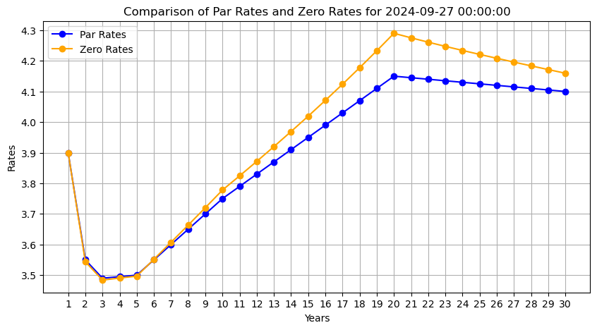

# Bootstrapping a Treasury Yield Curve

## Description

This project focuses on **Bond Yield Curve Construction and Analysis** as part of the financial modeling build project. It was completed under the supervision of industry expert **Edward Chlebus**.

### Key Highlights:
- **Python Framework**: Leveraged libraries like `Pandas`, `NumPy`, and `Matplotlib` to construct zero-coupon yield curves using bootstrapping techniques with high accuracy, validated against real-world data from **FRED** (Federal Reserve Economic Data).
- **Yield Analysis**: Calculated key financial metrics such as **Yield to Maturity (YTM)** to analyze bond prices and visualize trends in the fixed-income market.
- **Advanced Techniques**: Applied the **Nelson-Siegel model** to improve yield curve fitting and ensure alignment with market expectations.

## Setup Instructions

1. Download the Jupyter Notebook (`.ipynb`) file.
2. Run the notebook in any Python environment with Jupyter support (e.g., Jupyter Notebook or Jupyter Lab).

### Dependencies:
Ensure you have the following Python libraries installed:
- `pandas`
- `numpy`
- `matplotlib`

You can install these using `pip`:
```bash
pip install pandas numpy matplotlib
```

## Usage

This notebook:
1. Downloads interest rate data from **US Government public data** sources.
2. Constructs a yield curve from scratch using **bootstrapping techniques**.
3. Visualizes the results, including interpolated zero-coupon yield curves.

## Example Output

Below is an example result of the bootstrapped yield curve:



---

## Author

This project was developed as part of a hands-on fellowship in quantitative finance modeling with the Build Fellowship by OpenFundations.
